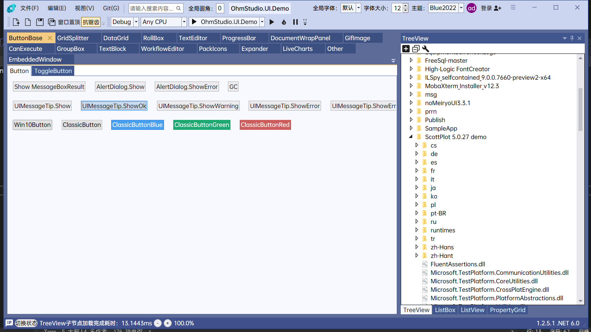

# OhmStudio.UI

#### Introduce
WPF UI Library

AvalonDock UI Library

### .Net Version
|.Net Version   | Status  |
|  ----  | ----  |
| net462  | ✅ |
| net5.0-windows  | ✅ |
| net8.0-windows  | ✅ |

# 💡 Install
Add nuget package:
```bash
dotnet add package OhmStudio.UI
```
Please use the latest version. I will update this package regularly to fix any bugs that may arise during testing.

# 🚀 Quick Start
``` xml
<Application.Resources>
    <ResourceDictionary>
        <ResourceDictionary.MergedDictionaries>
            //Themes for WPF control and AvalonDock, 2022 can be replaced with 2019, BlueTheme can be replaced with LightTheme or DarkTheme.
            <ResourceDictionary Source="/OhmStudio.UI;Component/Themes/VisualStudio2022/BlueTheme.xaml" />

            //Styles for WPF basic controls and custom controls, for example SearchBar, CheckComboBox, CircleProgressBar, etc...
            <ResourceDictionary Source="/OhmStudio.UI;Component/Styles/VisualStudio.xaml" />
        </ResourceDictionary.MergedDictionaries>
    </ResourceDictionary>
</Application.Resources>

//You can override the following resources, they are all the dynamic resources.

//InputElement:Button,ComboBox,TextBox,PasswordBox,SearchBar,NumericUpDown,PasswordTextBox,DateTimePicker,CheckComboBox.
<Thickness x:Key="InputElementPadding">2</Thickness>
<Thickness x:Key="InputElementBorderThickness">1</Thickness>

<Thickness x:Key="ComboBoxItemPadding">1</Thickness>
<Thickness x:Key="ComboBoxItemMargin">2,0</Thickness>

<Thickness x:Key="ListBoxItemPadding">2,0</Thickness>
<Thickness x:Key="ListBoxItemMargin">0</Thickness>

<Thickness x:Key="ListViewItemPadding">4,2</Thickness>
<Thickness x:Key="ListViewItemMargin">0,0,0,1</Thickness>
```
# 🙏 Special Thanks
- [GongSolutions.WPF.DragDrop](https://github.com/punker76/gong-wpf-dragdrop)
- [AakStudio.Shell.UI](https://github.com/Wenveo/AakStudio.Shell.UI)
- [AakStudio.Shell.UI.Themes.AvalonDock](https://github.com/Wenveo/AakStudio.Shell.UI.Themes.AvalonDock)
- [OriginalAuthor：Wenveo](https://www.bilibili.com/video/BV1yW4y1N7Zq/?spm_id_from=333.999.0.0)
The original author is no longer maintaining the library, so I’m now maintaining and updating this package.

# 📷 Screenshot
